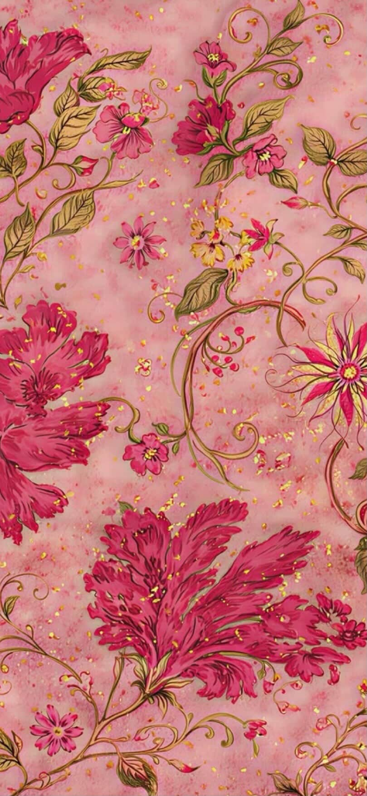

# Cartoon-Style-Renderer
A simple cartoon rendering tool using OpenCV bilateral filter
# Cartoon Rendering Project

## Demo
### Success Case (잘 된 예시)

- 루피 피규어의 외곽선이 뚜렷하게 추출되고 색상이 단순화됨.

### Failure Case (잘 안 된 예시)

- 복잡한 꽃무늬 패턴으로 인해 외곽선 노이즈가 심하게 발생함.

## 한계점 (Limitations)
- 필터 파라미터가 고정되어 있어 이미지의 해상도나 복잡도에 따라 결과의 차이가 큼.
- 배경이 너무 복잡한 경우 만화적인 느낌보다 노이즈가 강조됨.
